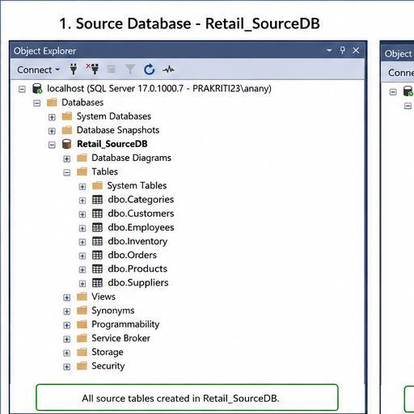
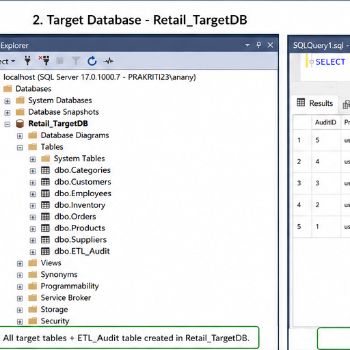
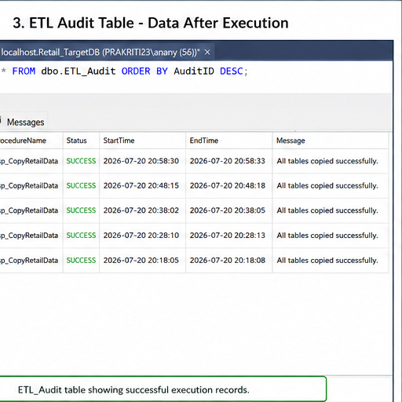
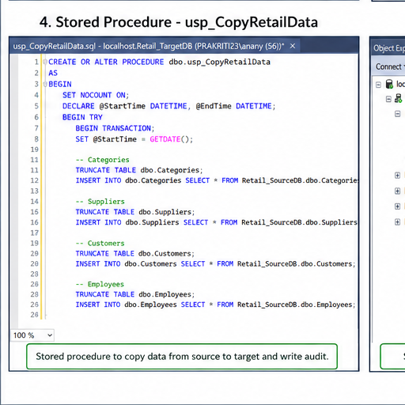
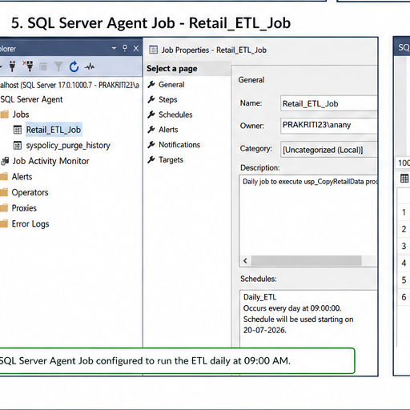
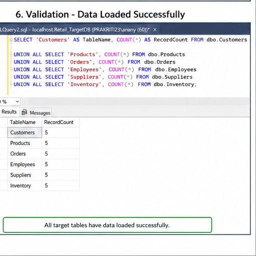

# 🛒 Retail ETL Automation using SQL Server

## 📌 Project Overview

This project demonstrates an end-to-end ETL (Extract, Transform, Load) automation pipeline built using Microsoft SQL Server technologies.

The project copies retail data from a Source Database to a Target Database using a stored procedure, automates execution through SQL Server Agent, logs every execution in an ETL Audit table, and sends Success/Failure email notifications using Database Mail.

---

## 🚀 Technologies Used

- SQL Server
- SSMS
- T-SQL
- SSIS
- SQL Server Agent
- Database Mail

---

## 📂 Project Structure

```text
Retail-ETL-Automation/
├── README.md
├── 01_Database_Creation.sql
├── 02_Create_Tables.sql
├── 03_Insert_Sample_Data.sql
├── 04_ETL_Audit.sql
├── 05_usp_CopyRetailData.sql
├── 06_Database_Mail.sql
├── 07_SQL_Server_Agent.sql
├── 08_SSIS_Guide.md
├── 09_Validation_Queries.sql
├── Screenshots/
├── Demo/
└── Documentation/
```

---

## ⚙️ Project Workflow

```
Retail_SourceDB
        │
        ▼
Stored Procedure
        │
        ▼
Retail_TargetDB
        │
        ▼
ETL_Audit
        │
        ▼
SQL Server Agent
        │
        ▼
Database Mail
        │
        ▼
Email Notification
```

---

## ✨ Features

- Automated ETL Process
- Stored Procedure Execution
- ETL Audit Logging
- SQL Server Agent Scheduling
- Database Mail Notifications
- SSIS Integration
- Validation Queries

---

## ▶️ Execution Order

1. 01_Database_Creation.sql
2. 02_Create_Tables.sql
3. 03_Insert_Sample_Data.sql
4. 04_ETL_Audit.sql
5. 05_usp_CopyRetailData.sql
6. 06_Database_Mail.sql
7. 07_SQL_Server_Agent.sql
8. 09_Validation_Queries.sql

## 📸 Project Screenshots

### Source Database


### Target Database


### ETL Audit


### Stored Procedure


### SQL Server Agent Job


### Validation Results



---


## Author

**Ananya Reddy**

**Skills:** Microsoft SQL Server • SSMS • T-SQL • SSIS • SQL Server Agent • Database Mail • ETL Development • Git & GitHub
---
